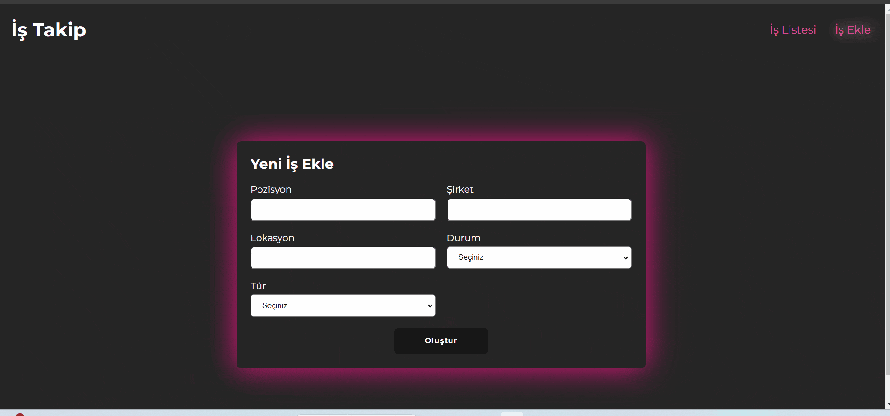

# TOOLKIT_JOB_APP
This project includes a job application application developed using Redux Toolkit.
A responsive, stylishly designed Job App that is compatible with every screen was created using React libraries.
You can add a job, track the job status, filter by job status and type, and remove the job from the list.
Easy and fast installation is provided with ConfigureStore.
Thanks to CreateSlice, action and reducer definitions have been made with simple and compact codes.
Components can access state with selectors.

## Libraries
* react-router-dom
* axios
* json-server
* react-redux
* @reduxjs/toolkit
* uuid
* react-icons
* react-toastify
* sass

## Gif

## # Designed by <a href="https://www.linkedin.com/in/h%C3%BCseyin-aslan-128519203/" target="_blank">Hüseyin ASLAN</a> 